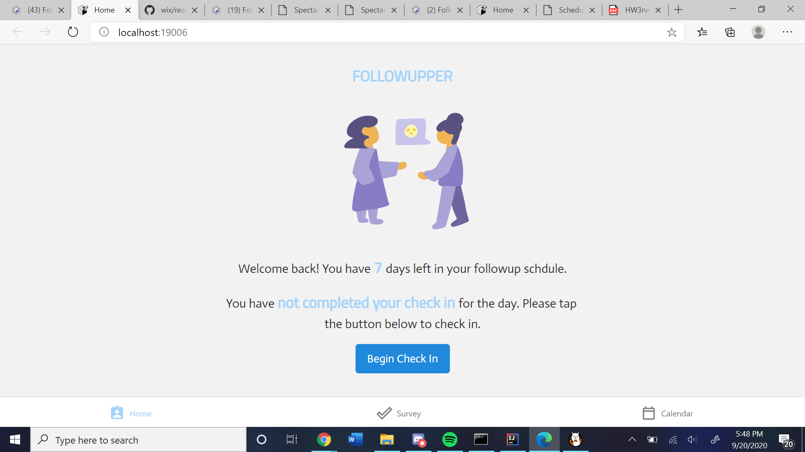
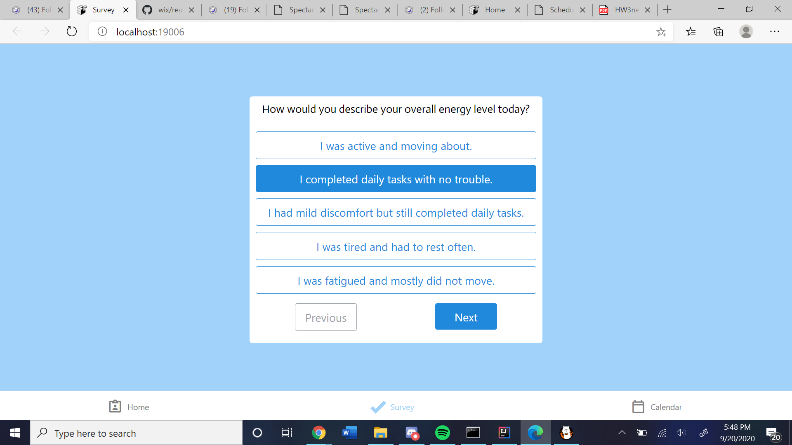
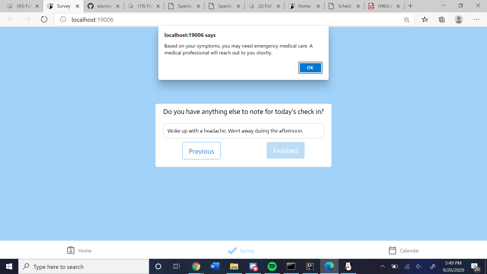
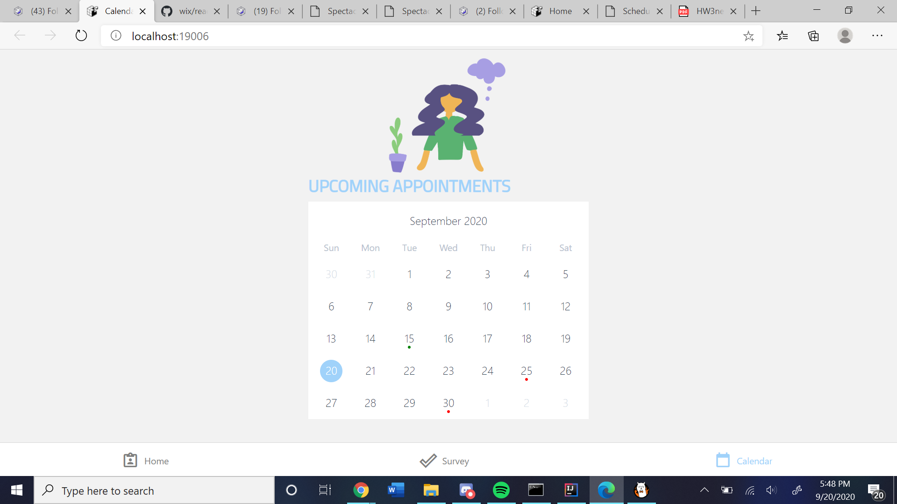
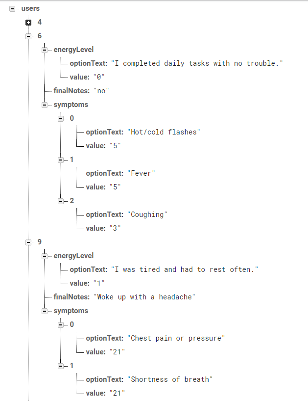
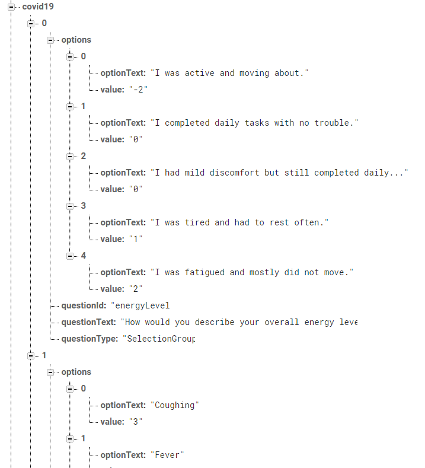

# FollowUpper
## Idea
After a medical incident, recovering patients have a variety of symptoms that have different levels of concern. It can be difficult to know which symptoms are more worrisome than others, and patients have trouble recalling symptoms that happened several days before a followup. Enter FollowUpper! We give medical professionals a simple and organized way of keeping track of their patients so both can have ease of mind. User fill out a short survey created by their doctor every day, and if you have symptoms that are a cause for concern, you'll be notified as well as your doctor for an easy followup.

## Technologies
We wanted the app to be widely accessible while also learning a modern framework, so we chose React-Native as the frontend. For our data management, we used Firebase as they are very easy to connect and have easy user functionality. We also couldn't have done it without these wonderful [survey](https://www.npmjs.com/package/react-native-simple-survey) and [calendar](https://github.com/wix/react-native-calendars) libraries.

## Execution

We wanted the app to be **quick and simple** so it doesn't feel like a pain to check in! It also had to be assessible and easy to understand for older folks.
### Frontend
The first screen shows the most important information, whether or not you've done your check in!

Different medical professionals like denists, general care physicians, or Georgia Tech's Covid-19 System can their schedule check-ins. The calendar gives patients a look ahead at their week. 

### Backend
We store the user responses in an easily parsed JSON format so that nurses can see their daily results.

We also are able to store doctor-created surveys to give to patients. Doctors will choose which answers are key symptoms with weights, and if a patient's answers sum to greater than a threshold, the doctor would be notified. 

## Challenges
Stephanie and I were both relatively new to React-Native, which made all of our tasks trial and error with a lot of debugging. Two features that were especially difficult were importing fonts and getting the user system working. Online resources regarding these were either outdated or too different from our project to use. The fonts led us to use React-Native web since Expo, custom fonts, and mobile didn't mesh well. **State management** was another challenge specifically for React-Native since some guides used class based state and some used functions and hooks, and some libraries were only for classes so we had to mix and match yet we couldn't get these two to mesh well together in the end. A final annoyance was that React-Native web does not have customizable alerts, so we couldn't do much with those.

## Next Steps
To fully flesh out this idea, we would need to develop the doctor's side of the app, as well as link them through the database. We'd also need to flesh out the connections between the two like administering surveys and appointments.
